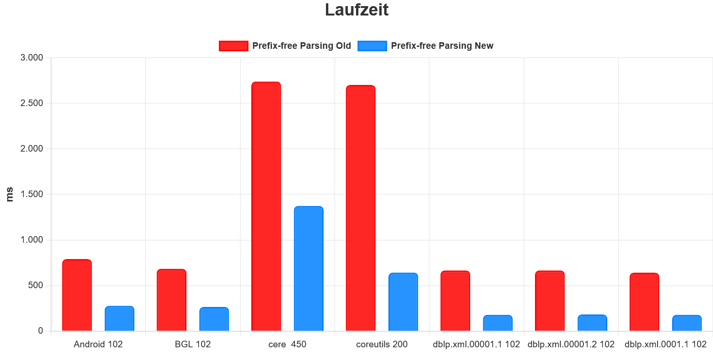
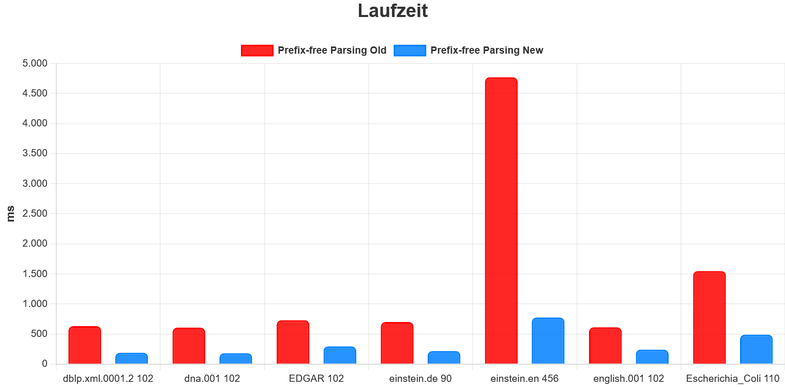
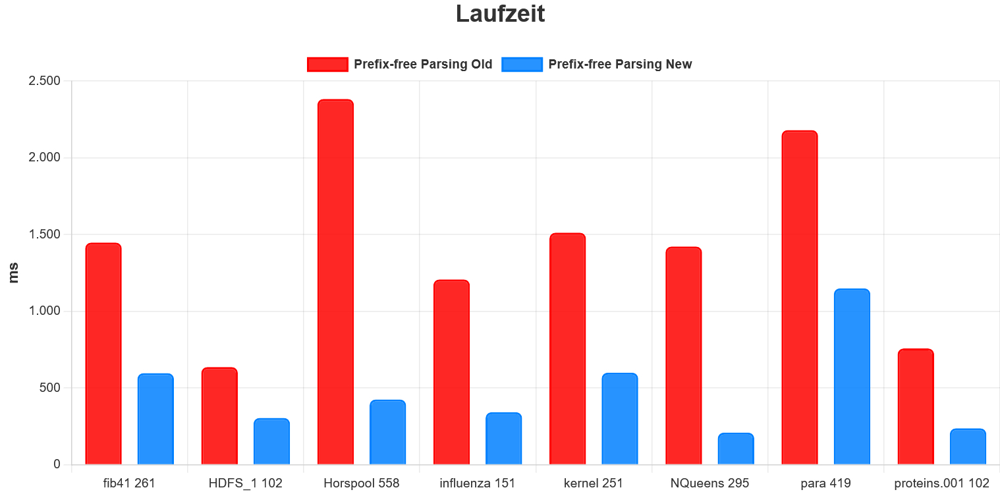
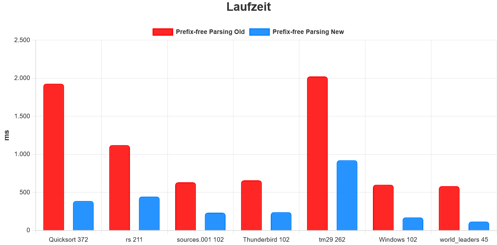
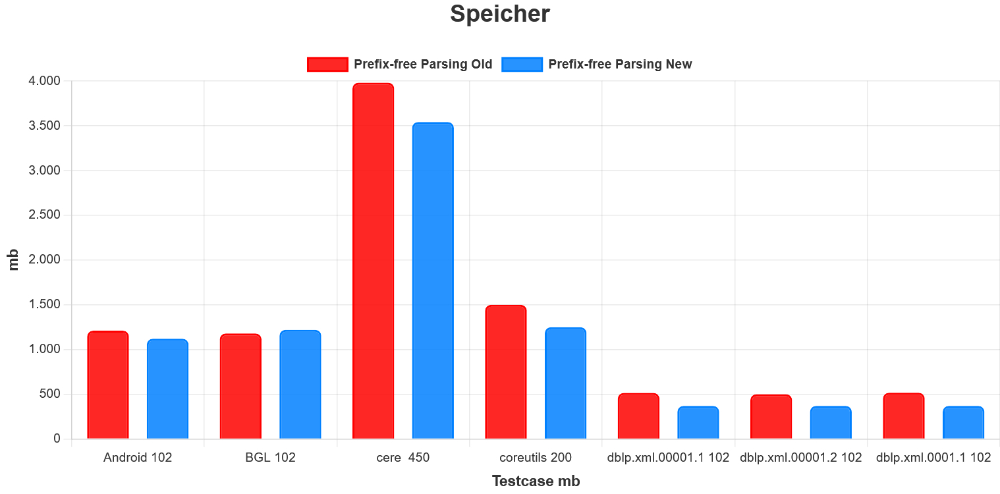
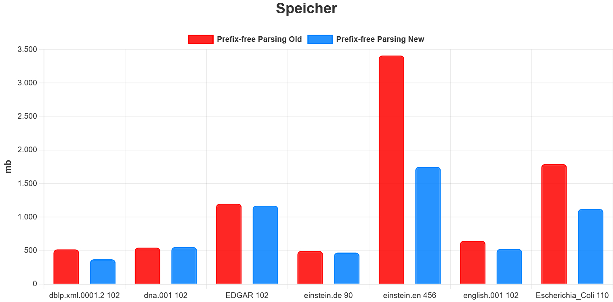
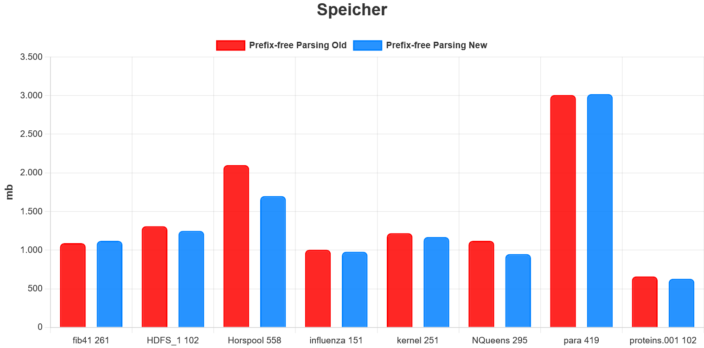
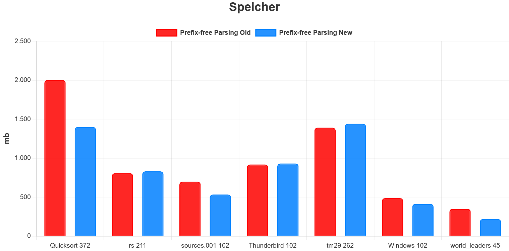

# GPU Prefix-Free Parsing für die Burrows-Wheeler-Transformation

Dieses Repository enthält eine CUDA-Implementierung des **Prefix-Free-Parsing-(PFP)-Algorithmus** zur parallelen Konstruktion der **Burrows-Wheeler-Transformation (BWT)** auf der GPU.

Die Implementierung ist insbesondere für große und stark repetitive Texte ausgelegt. Für die parallele Verarbeitung werden **CUDA**, **CUB** und **Thrust** eingesetzt.

## Verwendung

Das Programm liest den Eingabetext automatisch aus der Datei `input.txt` ein und schreibt die berechnete BWT in die Datei `out.txt`.

Das Programm wird ohne weitere Kommandozeilenargumente gestartet:

```bash
./Prefix_Free_Parsing
```

### Kompilierung

Die Implementierung wurde mit folgenden Compiler-Optionen kompiliert:

```bash
-O2 --use_fast_math
```

Für eine CUDA-Kompilierung kann beispielsweise verwendet werden:

```bash
nvcc -O2 --use_fast_math Prefix_Free_Parsing.cu -o Prefix_Free_Parsing
```

### Eingabeformat

Die erste Zahl in `input.txt` gibt die Länge des Eingabetextes an. Anschließend folgen die einzelnen Zeichen des Textes als Integer, die durch Leerzeichen getrennt sind.

Beispiel:

```text
5

2 4 1 4 2
```

Die `5` gibt an, dass der Eingabetext aus fünf Zeichen besteht:

```text
2 4 1 4 2
```

Die einzelnen Integer müssen im Bereich **0 bis 255** liegen.

Das Eingabealphabet darf höchstens **253 verschiedene Zeichen** enthalten.

### Ausgabeformat

Die berechnete BWT wird in `out.txt` geschrieben. Die erste Zahl gibt wieder die Länge des Textes an. Anschließend folgen die BWT-Zeichen als Integer, die durch Leerzeichen getrennt sind.

Für das obige Beispiel lautet die Ausgabe:

```text
5

4 4 2 2 1
```

## Anpassung der Parameter

Im Quellcode können verschiedene Parameter angepasst werden, um die Performance für unterschiedliche Eingabetexte zu optimieren.

Die beiden wichtigsten Verarbeitungsschritte des Algorithmus sind `Compute_D()` und `Compute_S()`. Sie machen mit großem Abstand den größten Anteil der Berechnung aus. Die Wahl der Parameter beeinflusst daher sowohl die Laufzeit als auch den Speicherverbrauch dieser beiden Schritte.

### Parameter `P`

`P` ist der wichtigste Parameter zur Abstimmung der Performance.

* **Größeres ****`P`**:

  * geringerer Speicherverbrauch und geringere Laufzeit von `Compute_D()`
  * höherer Speicherverbrauch bzw. höhere Laufzeit von `Compute_S()`
* **Kleineres ****`P`**:

  * höherer Speicherverbrauch und höhere Laufzeit von `Compute_D()`
  * geringerer Speicherverbrauch bzw. geringere Laufzeit von `Compute_S()`

Da `Compute_D()` und `Compute_S()` den mit Abstand größten Teil der Laufzeit und des Speicherverbrauchs ausmachen, muss zwischen beiden Verarbeitungsschritten abgewogen werden.

Als allgemeine Einstellung ist **`P = 23`** meistens eine gute Wahl. Abhängig vom Eingabetext können jedoch andere Werte deutlich bessere Ergebnisse liefern. Für einzelne Testfälle können beispielsweise **`P = 13`****, ****`23`****, ****`33`****, ****`45`**** oder ****`63`** sinnvoll sein.

### Parameter `W`

`W` sollte **nur sehr selten angepasst werden**.

Eine Erhöhung von `W` kann sinnvoll sein, wenn der W Zeichen lange Präfix des Eingabetextes besonders häufig vorkommt. Ein Beispiel hierfür ist der Testfall **`tm29`** aus dem repetitiven Pizza&Chili Corpus.

Für diesen Testfall ist beispielsweise

```text
W = 35
P = 81
```

eine sinnvolle Kombination.

Für normale Eingaben sollte `W` nicht verändert werden.

### Parameter `D_Word_Length_Cap_Mult_Constant`

Für `D_Word_Length_Cap_Mult_Constant` sollte ein Wert im Bereich

```text
[2.5, 4.5]
```

verwendet werden.

Der Parameter beeinflusst insbesondere den Speicherverbrauch und die Laufzeit von `Compute_D()`:

* **Größerer Wert**:

  * in der Regel geringfügig geringerer Speicherverbrauch
  * höhere Laufzeit von `Compute_D()`
* **Kleinerer Wert**:

  * in der Regel etwas höherer Speicherverbrauch
  * geringere Laufzeit von `Compute_D()`

Damit kann dieser Parameter genutzt werden, um zwischen Speicherverbrauch und Laufzeit abzuwägen.

### Andere Parameter

**Alle anderen Konstanten sollten nicht angepasst werden.**

## Benchmark

Die Implementierung wurde auf einer **NVIDIA RTX 2060 Super** mit 29 Testfällen aus dem **repetitiven Pizza&Chili Corpus** evaluiert.

Verglichen wurde die neue Implementierung mit der vorherigen GPU-Implementierung des Prefix-Free-Parsing-Algorithmus aus meiner Masterarbeit.

### Laufzeit

Über alle Testfälle ergibt sich:

* **3,39× durchschnittlicher Speedup**, wenn zunächst für jeden Testfall der Speedup berechnet und anschließend gemittelt wird.
* **3,16× Speedup** bezogen auf die Summe der Laufzeiten aller Testfälle.
* Gesamtlaufzeit der alten Implementierung: **37,57 s**
* Gesamtlaufzeit der neuen Implementierung: **11,88 s**
* Die neue Implementierung benötigt damit nur etwa **31,6 %** der Laufzeit der alten Implementierung.







### Speicherverbrauch

Über die Summe aller Testfälle ergibt sich:

* Speicherverbrauch alte Implementierung: **36.173 MB**
* Speicherverbrauch neue Implementierung: **30.783 MB**
* Die neue Implementierung benötigt damit etwa **85,1 %** des Speichers der alten Implementierung.
* Dies entspricht einer **Speicherreduktion von etwa 14,9 %**.






